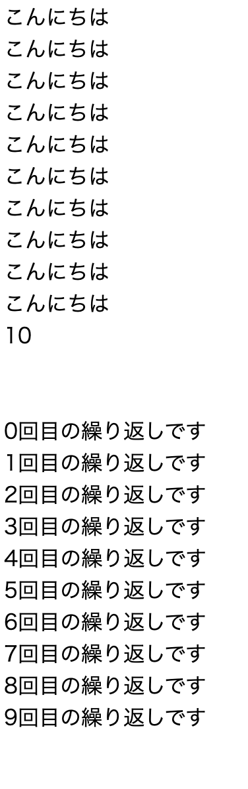
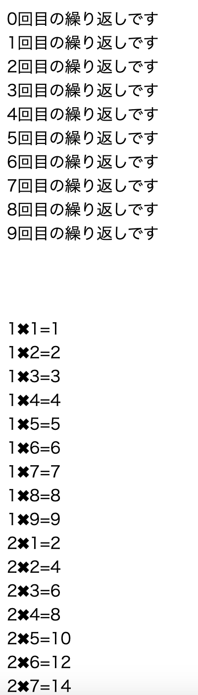

# PHP学習記録

## Progate
繰り返し学習

## 実践学習
### PHP

XAMPPをインストールし、 
Youtube「プログラミングアカデミー」→【PHP入門決定版】4時間で学ぶ初心者向けPHPプログラミングチュートリアル【PHPの基礎を徹底的にマスター】を視聴しながら学習。

- [練習1](practice-youtube-record/1-2.php) 

- [練習2](practice-youtube-record/1-3.php) 

- [練習3](practice-youtube-record/1-4.php)

- [練習4](practice-youtube-record/1-5.php) 

- [練習5](practice-youtube-record/1-6.php) 

- [練習6](practice-youtube-record/1-7.php) 

- [練習7](practice-youtube-record/1-8.php) 

- [練習8](practice-youtube-record/1-9.php) 

- [練習9](practice-youtube-record/1-10.php) 
 
 
 
 
 

- [練習10](practice-youtube-record/1-11.php) 

- [練習11](practice-youtube-record/1-12.php) 

- [練習12](practice-youtube-record/1-13.php) 

 
 

### MySQL
同じくYoutubeの動画を視聴しながら、phpMyadminにて、 
データの検索、CRUD操作　等を実施。 

- 実施例 
Q.世界の大陸の人口を全部足すと？ 
＊（カラム名をContinentPopulationと設定） 
 
 
 
Q.各大陸ごとの人口は？
 
